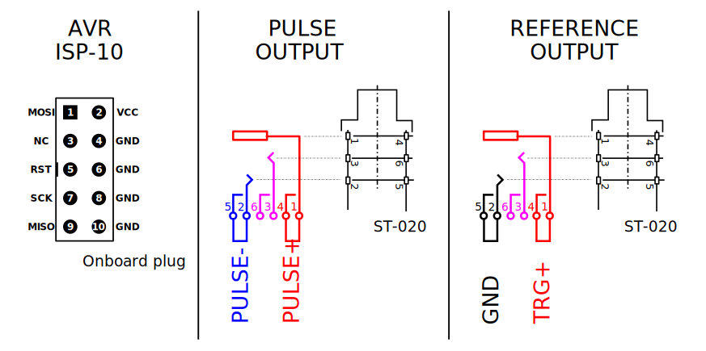

# u-SLON electrical circuit

u-SLON is small laboratory electrostimulator.  
This project is a part of [x-SLON project](https://github.com/comcon1/x-SLON).  
Please address the maternal project for detailed description.

Device is rather small and is assembled simply. We use the standard firm enclosure and face draft for it is attached. 
Please consult [assembly.txt](case/assembly.txt).

**Scheme of the device output**

Programmator connection is inside the enclosure. Output plugs are only USB and 2 Jacks (6.3 mm).
Pulse output has contacts galvanically separated from the rest circuit. 
Trigger output has the contact with trigger pulses with the fixed positive amplitude and the ground contact.

# Authors

Ilya Kuzmin <kuzmin.ilya@gmail.com>  
Peter Mamonov <pmamonov@gmail.com>  
Alexey Nesterenko <comcon1@protonmail.com>  

# Licensing

"u-SLON electrical circuit" project (I. Kuzmin, P. Mamonov, A. Nesterenko)
is released under license CC BY-SA 3.0.
